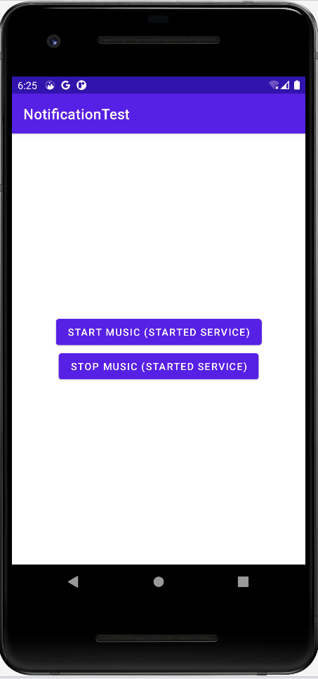
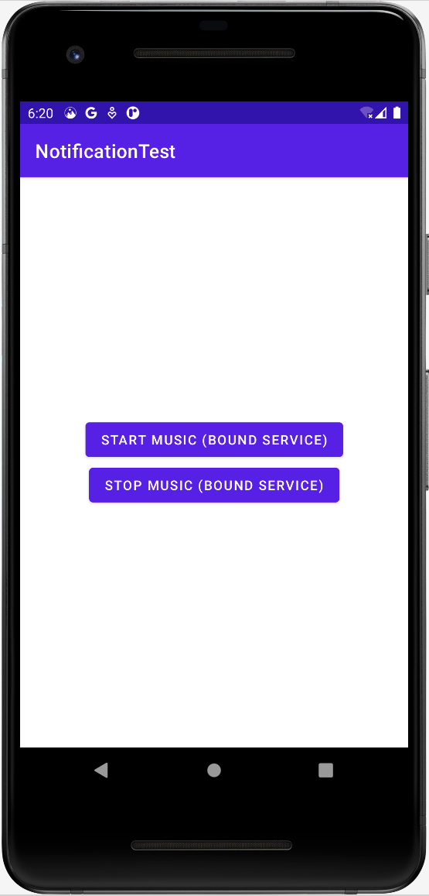

# foreground-service-in-android-practice
This is a sample app to learn implementing Android Foreground Services

 

### 'main' branch has code for Started Foreground Service
### 'bound-service' branch has code for Bound Service
